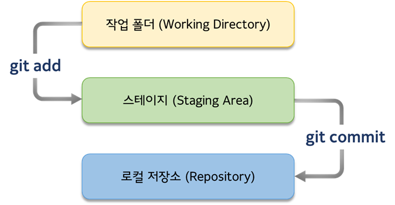

# [20.12.29~30] Git/GitHub 특강

> What? Why? How?

 프로젝트형 IoT 서비스 개발 교육 과정 중 Git/GitHub 특강을 유태영 강사님과 함께하였다. What, Why, How를 강조하신 것이 기억에 남는다. 어떻게 쓰는지보다는 무엇인지, 왜 쓰는지가 먼저이고, 면접에서 주로 질문하는 영역도 What & Why이기 때문에 간과해서는 안 된다고.

> Missing Semester - 누락된 학기
>
> https://missing.csail.mit.edu/

 학교에서 가르쳐주진 않지만 다룰 줄 알아야 하는 것들. MIT에서 컴퓨터 과학 교육에 자주 사용하는 Shell, Vim, Git 등의 도구 사용 방법을 다루는 교육 자료.

 인턴십 중 실무에서 Git을 사용하였지만 나에게 주어진 협업의 범위가 크지 않아 다양한 활용을 해보고 싶었다. 회사에서는 GUI 클라이언트 프로그램을 줄곧 사용하였는데, 교육을 통해 Git Bash를 통한 디테일한 명령어의 사용법을 익힐 수 있어 유익하였다. 이전에 직관적인 프로그램을 사용해 보았기에 교육 내용 이해가 쉬웠고 CLI 환경에서도 머릿속으로 어느 정도 그림이 그려졌던 것 같다.

 그리고 작업물은 회사 자료여서 개인적인 아카이빙이 힘들었다. 협업 프로젝트를 경험하고자 선택한 과정인 만큼 앞으로 5개월 간 Git/GitHub를 활용하여 의미 있는 결과물을 남기고자 한다.


## Git 기초

#### What

> VCS(Version Control System)

+ Git은 버전 관리 시스템이다.
+  
+ 위와 같이 버전 관리를 하게 되면 어떤 것이 최신인지 알아보기 힘들고, 비효율적임


#### Why

1. 기술 트렌드

+ 옛날에는 기술을 생산하는 사람들 == 기술을 활용하는 사람들이었음
+ 현대에는 기술을 생산하는 사람들이 꼭 기술을 활용하는 사람들은 아니게 됨
+ 기술의 이해만 있다면 누구든 활용 가능
  + TensorFlow - Airbnb, Xiaomi
  + Chromium - Edge, Opera, Whale
  + Linux, GCC, Python, git, ...

2. 오픈 소스

+ Do not reinvent the wheel
+ 오픈 소스를 활용하면 모든 것을 바닥부터 만들지 않아도 된다

3. 프로젝트

+ 프로젝트 중심의 자기소개서
+ 자기를 소개하는 것이 아닌, 자기가 한 것을 소개하는 것

4. GitHub

+ 개발자의 자기소개서, 포트폴리오, 증거 보관함

> 그러니까 왜 Git을 쓰냐면

+ 효율적인 버전관리를 하려고 쓰는 건데
+ 로컬에서 원격 저장소로 백업도 하고
+ 협업도 하고
+ 오픈 소스 작업하려고
+ 그러다 보니 오픈 소스가 모이는 곳이 되었고
+ 개발자들이 아카이빙하는 곳이 됨


#### How

##### Git Bash 명령어 모음

+ `git config` : 커밋 시 사용할 유저 네임과 이메일 설정

  + PC 당 최초 1회만 하면 됨
  + 작성자가 누구인지 표시하는 서명과 같다고 함

  ```
  git config --global user.name "your_name"
  git config --global user.email "your_email@example.com"
  ```

+ `git init` : 작업 폴더를 로컬 저장소(리포)로 만듦

  + (master) 브랜치로 보이면 성공한 것
  + .git 폴더가 생기고, 트래킹이 시작되는 것임. CCTV를 다는 것과 같음
  + 리포에서 다시 일반 폴더로 만들려면? `rm -r .git/`
  + 이때 주의할 점은 home 폴더(~)를 리포로 만들면 안 된다는 점이다. 홈 폴더의 작업을 트래킹할 것이 아니기 때문. 또, 리포가 중첩되면 서브모듈이 되어버림.

+ `git status` : 로컬 저장소의 현재 상태 보기

  + CCTV에게 상황이 어떤지 물어보는 것

+ `git add` : 스테이지에 파일 올리기

  + 파일을 트래킹하기 위함
  + CCTV의 화각(스테이지)에 파일을 집어넣는 것

  ```
  # 특정 파일을 스테이징할 때
  git add test.py
  
  # 현재 폴더 전체를 스테이징할 때
  git add .
  ```

+ `git commit` : 스테이지의 파일을 로컬 저장소에 저장

  ```
  # "" or '' 안에 커밋 메시지 입력 후 커밋
  git commit -m '커밋 메시지'
  
  # 에디터(vim)에 커밋 메시지 입력 및 저장 후 커밋
  git commit
  ```

+ `git log` : 지금까지 커밋에 대한 이력 조회

+ 여기까지 과정을 그림으로 나타내면 아래와 같다



+ `git remote` : 로컬 저장소와 원격 저장소 연결

  ```
  git remote add origin https://~원격 저장소 주소~
  
  # 연결된 원격 저장소 확인
  git remote -v
  ```

+ `git push` : 커밋된 변경사항 원격 저장소에 저장

  ```
  git push origin master
  ```

+ `git pull` : 원격 저장소에서 내려받을 때

  + 주로 협업 시, 아래와 같은 상황에서 사용
  + 이미 변경된 파일이 원격 저장소에 있을 때 변경 사항을 저장하고자 하면 [rejected] master -> master (fetch first) 와 같은 에러가 발생함

  ```
  git pull origin master
  ```

---

##### Branch

+ 여럿이 master 브랜치 한 곳에서 작업하다보면 충돌이 필연적으로 일어남
+ 코드에 뭔가 실험을 해볼 땐 '평행 세계'와 같은 브랜치를 따서 작업해야 함
+ 망하면 날리면 되고, 유지할 거면 합치면 됨
+ 합친 후에 브랜치는 역할을 다 한 것이므로 지우면 됨 브랜치는 태생적으로 합쳐져서 사라지기 위해 만들어지는 것
+ 풀 리퀘스트(PR)는 merge하기 위해 보내는 것
+ 협업하는 사람한테 봐달라 하고 승인 받아 합치는 것
+ 마찬가지로 합치고 나면 그 브랜치 지우면 됨

+ `git branch` : 브랜치 관련 명령어

  ```
  # 브랜치 조회
  git branch
  
  # 브랜치 생성
  git branch 브랜치명
  
  # 브랜치 삭제
  git branch -d 브랜치명
  ```

+ `git switch` : 브랜치 이동

  + 원래 git checkout 명령어 이용하였는데 최근에 대체됨 (checkout 명령어가 가진 기능이 많아 모호하다고)

  ```
  git switch 이동할 브랜치명
  
  # 브랜치 만들면서 동시에 이동할 때 (create)
  git switch -c 이동할 브랜치
  ```

+ `git merge` : 브랜치 합치기

  + master 브렌치가 주체가 되어야 하기 때문에 헤드가 마스터 브랜치 가리키는 상태에서 해야 함

  ```
  git merge 합칠 브랜치명
  ```

  